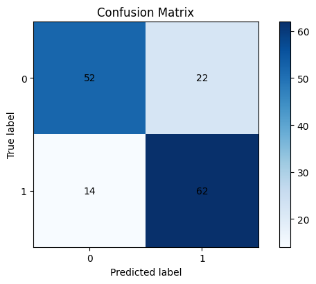
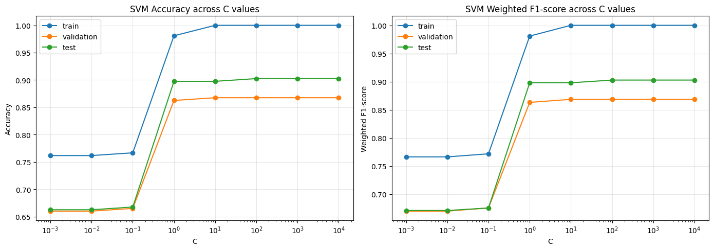

# hw result from ipynb
## Section 1
### 5-fold cross-validation average accuracy on the training data:

<table id="T_973ef">
  <thead>
    <tr>
      <th class="index_name level0" >reg_lambda</th>
      <th id="T_973ef_level0_col0" class="col_heading level0 col0" >1.000000</th>
      <th id="T_973ef_level0_col1" class="col_heading level0 col1" >2.000000</th>
      <th id="T_973ef_level0_col2" class="col_heading level0 col2" >4.000000</th>
      <th id="T_973ef_level0_col3" class="col_heading level0 col3" >8.000000</th>
    </tr>
    <tr>
      <th class="index_name level0" >learning_rate</th>
      <th class="blank col0" >&nbsp;</th>
      <th class="blank col1" >&nbsp;</th>
      <th class="blank col2" >&nbsp;</th>
      <th class="blank col3" >&nbsp;</th>
    </tr>
  </thead>
  <tbody>
    <tr>
      <th id="T_973ef_level0_row0" class="row_heading level0 row0" >0.005000</th>
      <td id="T_973ef_row0_col0" class="data row0 col0" >0.7171</td>
      <td id="T_973ef_row0_col1" class="data row0 col1" >0.7200</td>
      <td id="T_973ef_row0_col2" class="data row0 col2" >0.7257</td>
      <td id="T_973ef_row0_col3" class="data row0 col3" >0.7229</td>
    </tr>
    <tr>
      <th id="T_973ef_level0_row1" class="row_heading level0 row1" >0.010000</th>
      <td id="T_973ef_row1_col0" class="data row1 col0" >0.7229</td>
      <td id="T_973ef_row1_col1" class="data row1 col1" >0.7286</td>
      <td id="T_973ef_row1_col2" class="data row1 col2" >0.7257</td>
      <td id="T_973ef_row1_col3" class="data row1 col3" >0.7171</td>
    </tr>
    <tr>
      <th id="T_973ef_level0_row2" class="row_heading level0 row2" >0.100000</th>
      <td id="T_973ef_row2_col0" class="data row2 col0" >0.7229</td>
      <td id="T_973ef_row2_col1" class="data row2 col1" >0.7257</td>
      <td id="T_973ef_row2_col2" class="data row2 col2" >0.7257</td>
      <td id="T_973ef_row2_col3" class="data row2 col3" >0.7171</td>
    </tr>
    <tr>
      <th id="T_973ef_level0_row3" class="row_heading level0 row3" >0.500000</th>
      <td id="T_973ef_row3_col0" class="data row3 col0" >0.7229</td>
      <td id="T_973ef_row3_col1" class="data row3 col1" >0.6914</td>
      <td id="T_973ef_row3_col2" class="data row3 col2" >0.5343</td>
      <td id="T_973ef_row3_col3" class="data row3 col3" >0.4657</td>
    </tr>
  </tbody>
</table>

### Top two hyperparameter settings:

<table id="T_9308b">
  <thead>
    <tr>
      <th class="blank level0" >&nbsp;</th>
      <th id="T_9308b_level0_col0" class="col_heading level0 col0" >learning_rate</th>
      <th id="T_9308b_level0_col1" class="col_heading level0 col1" >reg_lambda</th>
      <th id="T_9308b_level0_col2" class="col_heading level0 col2" >mean_accuracy</th>
      <th id="T_9308b_level0_col3" class="col_heading level0 col3" >std_accuracy</th>
    </tr>
  </thead>
  <tbody>
    <tr>
      <th id="T_9308b_level0_row0" class="row_heading level0 row0" >0</th>
      <td id="T_9308b_row0_col0" class="data row0 col0" >0.010</td>
      <td id="T_9308b_row0_col1" class="data row0 col1" >2.0</td>
      <td id="T_9308b_row0_col2" class="data row0 col2" >0.7286</td>
      <td id="T_9308b_row0_col3" class="data row0 col3" >0.0579</td>
    </tr>
    <tr>
      <th id="T_9308b_level0_row1" class="row_heading level0 row1" >1</th>
      <td id="T_9308b_row1_col0" class="data row1 col0" >0.005</td>
      <td id="T_9308b_row1_col1" class="data row1 col1" >4.0</td>
      <td id="T_9308b_row1_col2" class="data row1 col2" >0.7257</td>
      <td id="T_9308b_row1_col3" class="data row1 col3" >0.0331</td>
    </tr>
  </tbody>
</table>

### Report the testing results using the “evaluate_binary_classifier” function
Top 1: lr=0.01, reg_lambda=2.0
Accuracy  : 0.7600
Precision : 0.7381
Recall    : 0.8158
F1-score  : 0.7750

Top 2: lr=0.005, reg_lambda=4.0
Accuracy  : 0.7533
Precision : 0.7241
Recall    : 0.8289
F1-score  : 0.7730

Observations:
1. In 5-fold cross-validation, the best average training accuracy was 0.7286, achieved with learning_rate=0.01 and reg_lambda=2.0.
2. The top two settings were selected by average CV accuracy and then retrained on the full training split before testing, so the test metrics estimate generalization to unseen data.
3. On the testing data, the best of the two selected settings by accuracy was learning_rate=0.01 and reg_lambda=2.0, with Accuracy=0.7600, Precision=0.7381, Recall=0.8158, and F1-score=0.7750.
4. If several settings have very similar CV accuracy, the simpler preference is to choose the setting with the smaller CV standard deviation because it is more stable across folds.

## Section 2
### SVM result at C=1.0

<table id="T_08ac5">
  <thead>
    <tr>
      <th class="blank level0" >&nbsp;</th>
      <th id="T_08ac5_level0_col0" class="col_heading level0 col0" >split</th>
      <th id="T_08ac5_level0_col1" class="col_heading level0 col1" >accuracy</th>
      <th id="T_08ac5_level0_col2" class="col_heading level0 col2" >f1_weighted</th>
    </tr>
  </thead>
  <tbody>
    <tr>
      <th id="T_08ac5_level0_row0" class="row_heading level0 row0" >0</th>
      <td id="T_08ac5_row0_col0" class="data row0 col0" >train</td>
      <td id="T_08ac5_row0_col1" class="data row0 col1" >0.9808</td>
      <td id="T_08ac5_row0_col2" class="data row0 col2" >0.9809</td>
    </tr>
    <tr>
      <th id="T_08ac5_level0_row1" class="row_heading level0 row1" >1</th>
      <td id="T_08ac5_row1_col0" class="data row1 col0" >validation</td>
      <td id="T_08ac5_row1_col1" class="data row1 col1" >0.8625</td>
      <td id="T_08ac5_row1_col2" class="data row1 col2" >0.8630</td>
    </tr>
    <tr>
      <th id="T_08ac5_level0_row2" class="row_heading level0 row2" >2</th>
      <td id="T_08ac5_row2_col0" class="data row2 col0" >test</td>
      <td id="T_08ac5_row2_col1" class="data row2 col1" >0.8975</td>
      <td id="T_08ac5_row2_col2" class="data row2 col2" >0.8979</td>
    </tr>
  </tbody>
</table>

### SVM result for different C

Observation:
The best generalization choice is C=10, selected by the highest validation weighted F1-score (0.8683) and validation accuracy (0.8675). If multiple C values tie, the smallest C is chosen to keep regularization stronger.
Very small C values underfit because the margin is too strongly regularized, while very large C values can increase training performance without improving validation performance.
Therefore, the validation set is used to choose C, and the test set is kept as the final unseen-data check for that selected model.

## Section3
### all frequent patterns showing support ≥ 0.3

<table id="T_4bbc0">
  <thead>
    <tr>
      <th class="blank level0" >&nbsp;</th>
      <th id="T_4bbc0_level0_col0" class="col_heading level0 col0" >support</th>
      <th id="T_4bbc0_level0_col1" class="col_heading level0 col1" >itemsets_text</th>
    </tr>
  </thead>
  <tbody>
    <tr>
      <th id="T_4bbc0_level0_row0" class="row_heading level0 row0" >0</th>
      <td id="T_4bbc0_row0_col0" class="data row0 col0" >0.6820</td>
      <td id="T_4bbc0_row0_col1" class="data row0 col1" >ram_medium</td>
    </tr>
    <tr>
      <th id="T_4bbc0_level0_row1" class="row_heading level0 row1" >1</th>
      <td id="T_4bbc0_row1_col0" class="data row1 col0" >0.4160</td>
      <td id="T_4bbc0_row1_col1" class="data row1 col1" >px_width_medium</td>
    </tr>
    <tr>
      <th id="T_4bbc0_level0_row2" class="row_heading level0 row2" >2</th>
      <td id="T_4bbc0_row2_col0" class="data row2 col0" >0.4140</td>
      <td id="T_4bbc0_row2_col1" class="data row2 col1" >battery_power_medium</td>
    </tr>
    <tr>
      <th id="T_4bbc0_level0_row3" class="row_heading level0 row3" >3</th>
      <td id="T_4bbc0_row3_col0" class="data row3 col0" >0.4120</td>
      <td id="T_4bbc0_row3_col1" class="data row3 col1" >int_memory_medium</td>
    </tr>
    <tr>
      <th id="T_4bbc0_level0_row4" class="row_heading level0 row4" >4</th>
      <td id="T_4bbc0_row4_col0" class="data row4 col0" >0.3180</td>
      <td id="T_4bbc0_row4_col1" class="data row4 col1" >battery_power_medium, ram_medium</td>
    </tr>
    <tr>
      <th id="T_4bbc0_level0_row5" class="row_heading level0 row5" >5</th>
      <td id="T_4bbc0_row5_col0" class="data row5 col0" >0.3160</td>
      <td id="T_4bbc0_row5_col1" class="data row5 col1" >int_memory_low</td>
    </tr>
    <tr>
      <th id="T_4bbc0_level0_row6" class="row_heading level0 row6" >6</th>
      <td id="T_4bbc0_row6_col0" class="data row6 col0" >0.3080</td>
      <td id="T_4bbc0_row6_col1" class="data row6 col1" >battery_power_low</td>
    </tr>
    <tr>
      <th id="T_4bbc0_level0_row7" class="row_heading level0 row7" >7</th>
      <td id="T_4bbc0_row7_col0" class="data row7 col0" >0.3060</td>
      <td id="T_4bbc0_row7_col1" class="data row7 col1" >px_width_medium, ram_medium</td>
    </tr>
  </tbody>
</table>

### list all the association rules where support ≥ 0.3, confidence ≥ 0.4 and lift ≥ 0.8

<table id="T_ed26d">
  <thead>
    <tr>
      <th class="blank level0" >&nbsp;</th>
      <th id="T_ed26d_level0_col0" class="col_heading level0 col0" >antecedents_text</th>
      <th id="T_ed26d_level0_col1" class="col_heading level0 col1" >consequents_text</th>
      <th id="T_ed26d_level0_col2" class="col_heading level0 col2" >support</th>
      <th id="T_ed26d_level0_col3" class="col_heading level0 col3" >confidence</th>
      <th id="T_ed26d_level0_col4" class="col_heading level0 col4" >lift</th>
    </tr>
  </thead>
  <tbody>
    <tr>
      <th id="T_ed26d_level0_row0" class="row_heading level0 row0" >0</th>
      <td id="T_ed26d_row0_col0" class="data row0 col0" >battery_power_medium</td>
      <td id="T_ed26d_row0_col1" class="data row0 col1" >ram_medium</td>
      <td id="T_ed26d_row0_col2" class="data row0 col2" >0.3180</td>
      <td id="T_ed26d_row0_col3" class="data row0 col3" >0.7681</td>
      <td id="T_ed26d_row0_col4" class="data row0 col4" >1.1263</td>
    </tr>
    <tr>
      <th id="T_ed26d_level0_row1" class="row_heading level0 row1" >1</th>
      <td id="T_ed26d_row1_col0" class="data row1 col0" >ram_medium</td>
      <td id="T_ed26d_row1_col1" class="data row1 col1" >battery_power_medium</td>
      <td id="T_ed26d_row1_col2" class="data row1 col2" >0.3180</td>
      <td id="T_ed26d_row1_col3" class="data row1 col3" >0.4663</td>
      <td id="T_ed26d_row1_col4" class="data row1 col4" >1.1263</td>
    </tr>
    <tr>
      <th id="T_ed26d_level0_row2" class="row_heading level0 row2" >2</th>
      <td id="T_ed26d_row2_col0" class="data row2 col0" >px_width_medium</td>
      <td id="T_ed26d_row2_col1" class="data row2 col1" >ram_medium</td>
      <td id="T_ed26d_row2_col2" class="data row2 col2" >0.3060</td>
      <td id="T_ed26d_row2_col3" class="data row2 col3" >0.7356</td>
      <td id="T_ed26d_row2_col4" class="data row2 col4" >1.0786</td>
    </tr>
    <tr>
      <th id="T_ed26d_level0_row3" class="row_heading level0 row3" >3</th>
      <td id="T_ed26d_row3_col0" class="data row3 col0" >ram_medium</td>
      <td id="T_ed26d_row3_col1" class="data row3 col1" >px_width_medium</td>
      <td id="T_ed26d_row3_col2" class="data row3 col2" >0.3060</td>
      <td id="T_ed26d_row3_col3" class="data row3 col3" >0.4487</td>
      <td id="T_ed26d_row3_col4" class="data row3 col4" >1.0786</td>
    </tr>
  </tbody>
</table>

### 
Observations:
1. The most frequent pattern is {ram_medium}, with support=0.6820.
2. Among single-feature categories, {ram_medium} appears most often, suggesting it is a common characteristic of phones in price_range=1.
3. The strongest displayed rule by support is {battery_power_medium} -> {ram_medium}, with support=0.3180, confidence=0.7681, and lift=1.1263.
4. Rules with lift greater than 1 indicate category combinations that occur together more often than expected under independence.
